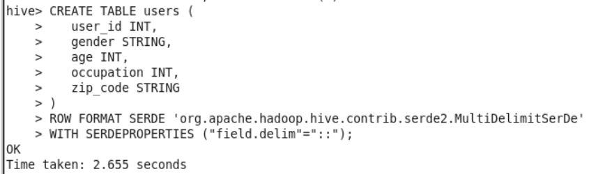
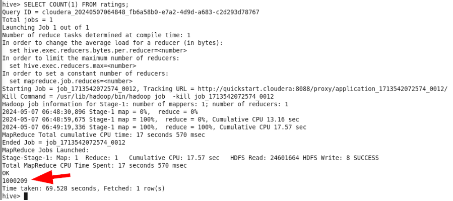

# 1. Hadoop Ingestion, and usage of Hive, Sqoop and MySQL
- [1. Hadoop Ingestion, and usage of Hive, Sqoop and MySQL](#1-hadoop-ingestion-and-usage-of-hive-sqoop-and-mysql)
  - [1.1. Ingestion to Hadoop and Queries with Hive](#11-ingestion-to-hadoop-and-queries-with-hive)
    - [Loading Data into Hive](#loading-data-into-hive)
    - [Queries in Hive](#queries-in-hive)
  - [1.2. Sqoop export to MySQL](#12-sqoop-export-to-mysql)


## 1.1. Ingestion to Hadoop and Queries with Hive

### Loading Data into Hive

**Importing Data to the Virtual Machine**

First, we'll create a folder named `dataset-exercise1` in the `dh-course` folder.

Now, let's proceed to import the files into that folder. From the "Machine" menu, click on "File Manager". Log in with:

- Username: cloudera
- Password: cloudera

Select source folder:

```
C:\..\sample_dataset-main
```

Select destination folder:

```
/home/cloudera/dh-course/dataset-exercise1
```

Copy the three files:

- `movies.dat`
- `ratings.dat`
- `users.dat`

Verify that the import has been done correctly:

```bash
cd /home/cloudera/dh-course/dataset-exercise1
ls -l
```


We see that in the file permissions, only the owner of the file has read and write permissions. No read, write, or execute permissions are granted to any other user or group.

To avoid permission issues, let's grant all possible permissions (read, write, and execute) to all possible users (file owner, group, and others):

```bash
chmod 777 movies.dat
chmod 777 ratings.dat
chmod 777 users.dat
ls -l
```


Review the content of the files:

```bash
cat <file-name>
```

**movies.dat**


**ratings.dat**


**users.dat**


**Data Ingestion to Hadoop: Creating the Database and Tables in Hive**

**Creating the Database**

```sql
CREATE DATABASE exercise1;
SHOW DATABASES;
USE exercise1;
```


This is the content of the `/user/hive/warehouse` path:

```hive
dfs -ls /user/hive/warehouse;
```


**Movies Table**

Create the table for movies:

```
CREATE TABLE movies (
    movie_id INT,
    title STRING,
    genres STRING
)
ROW FORMAT SERDE 'org.apache.hadoop.hive.contrib.serde2.MultiDelimitSerDe'
WITH SERDEPROPERTIES ("field.delim"="::");
```


I used this Stack Overflow solution to solve the multi-character delimiters problem: 
[Create HIVE Table with multi character delimiter - Stack Overflow](https://stackoverflow.com/questions/18931427/create-hive-table-with-multi-character-delimiter)

This is the content of the `/user/hive/warehouse/exercise1.db` path:

```
dfs -ls /user/hive/warehouse/exercise1.db;
```


Now move the file from Linux to the Hive folder:

```
!hadoop fs -put /home/cloudera/dh-course/dataset-exercise1/movies.dat /user/hive/warehouse/exercise1.db/movies;
```


Check if the data looks correct:

```sql
SELECT * FROM movies LIMIT 10;
```


Another type of query to verify that it has been imported correctly:

```sql
SELECT * FROM movies WHERE genres LIKE '%Fantasy%' LIMIT 3;
```


Let's see how many lines have been imported by doing a count:

```sql
SELECT COUNT(1) FROM movies;
```


This corresponds to the number of lines we had in the original file, so we ensure that all lines have been imported:

```bash
wc -l movies.dat
```


**Users Table**

Create the table for users:



This is the content of the `/user/hive/warehouse/exercise1.db` path:


Now move the file from Linux to the Hive folder:


Check if the data looks correct:


Verify how many lines have been imported by doing a count:


This corresponds to the number of lines we had in the original file, so we ensure that all lines have been imported:


**Ratings Table**

Create the table for ratings:


This is the content of the `/user/hive/warehouse/exercise1.db` path:


Now move the file from Linux to the Hive folder:


Check if the data looks correct:


Verify how many lines have been imported by doing a count:



This corresponds to the number of lines we had in the original file, so we ensure that all lines have been imported:


### Queries in Hive

**Which movie has the most reviews?**

Query used:

```sql
SELECT m.movie_id, m.title, m.genres, COUNT(r.movie_id) AS num_reviews
FROM movies m
JOIN ratings r ON m.movie_id = r.movie_id
GROUP BY m.movie_id, m.title, m.genres
ORDER BY num_reviews DESC
LIMIT 1;
```

Result:


```
American Beauty (1999), Comedy | Drama with 3428 reviews.
```

**Which are the top 10 most active users in rating movies?**

Query used:

```sql
SELECT user_id, COUNT(*) AS num_ratings
FROM ratings
GROUP BY user_id
ORDER BY num_ratings DESC
LIMIT 10;
```

Result:


```
4169 2314
1680 1850
4277 1743
1941 1595
1181 1521
889 1518
3618 1344
2063 1323
1150 1302
1015 1286
```

**What are the top three and bottom three movies according to scores?**

Top movies, query used:

```sql
SELECT m.movie_id, m.title, m.genres, AVG(r.rating) AS avg_rating
FROM movies m
JOIN ratings r ON m.movie_id = r.movie_id
GROUP BY m.movie_id, m.title, m.genres
ORDER BY avg_rating DESC
LIMIT 3;
```

Top movies, result:


```
1830 Follow the Bitch (1998) Comedy 5.0
3233 Smashing Time (1967) Comedy 5.0
3607 One Little Indian (1973) Comedy|Drama|Western 5.0
```

Worst movies, query used:

```sql
SELECT m.movie_id, m.title, AVG(r.rating) AS avg_rating
FROM movies m
JOIN ratings r ON m.movie_id = r.movie_id
GROUP BY m.movie_id, m.title
ORDER BY avg_rating ASC
LIMIT 3;
```

Worst movies, result:


```
3460 Hillbillys in a Haunted House (1967) 1.0
2217 Elstree Calling (1930) 1.0
641 Little Indian, Big City (Un indien dans la ville) (1994) 1.0
```

**Is there any profession we should focus our advertising efforts on? Why?**

To analyze if there's any profession we should focus on, we need to review which professions rate movies the most.

Query to see which professions rate the most:

```sql
SELECT u.occupation, COUNT(r.user_id) AS num_ratings
FROM users u
JOIN ratings r ON u.user_id = r.user_id
GROUP BY u.occupation
ORDER BY num_ratings DESC;
```

Result obtained:


```
4   131032
0   130499
7   105425
1   85351
17  72816
20  60397
12  57214
2   50068
14  49109
16  46021
6   37205
3   31623
10  23290
15  22951
5   21850
11  20563
19  14904
13  13754
18  12086
9   11345
8   2706
```


**Do you have any other valuable insights that we could extract from the processed data? How?**

We could analyze the demographic profile of users, such as gender and age, to better understand how movie preferences differ across demographic profiles.

For instance, we could calculate the average ratings of the top-rated movie "American Beauty (1999)" based on the users' gender using the following SQL query:

```sql
SELECT u.gender, AVG(r.rating) AS avg_rating
FROM users u
JOIN ratings r ON u.user_id = r.user_id
JOIN movies m ON r.movie_id = m.movie_id
WHERE m.title = 'American Beauty (1999)'
GROUP BY u.gender
ORDER BY u.gender;
```

The result obtained is as follows:


In this case, we see that there is not much difference in the results.

We check the differences for another movie: "Parent Trap, The (1998)". Query:

```sql
SELECT u.gender, AVG(r.rating) AS avg_rating
FROM users u
JOIN ratings r ON u.user_id = r.user_id
JOIN movies m ON r.movie_id = m.movie_id
WHERE m.title = 'Parent Trap, The (1998)'
GROUP BY u.gender
ORDER BY u.gender;
```

Result:


In this case, we see that the difference is slightly larger.

## 1.2. Sqoop export to MySQL

We will implement, through Scoop, a relational database in MySQL containing the data from one of the insights extracted in the previous practical exercise: the query where we calculate the professions where we should focus our advertising efforts.


**Create table in Hive**

To export the data from the result of a Hive query, we first need to create a table with the results of the Hive query.

We create the occupation_count table:

```
CREATE TABLE occupation_count (
    occupation INT,
    review_count INT
)
ROW FORMAT DELIMITED FIELDS TERMINATED BY ',';
```


We insert the query results into the created table in Hive:

```sql
INSERT INTO TABLE occupation_count SELECT u.occupation, COUNT(r.user_id) AS num_ratings
FROM users u
JOIN ratings r ON u.user_id = r.user_id
GROUP BY u.occupation
ORDER BY num_ratings DESC;
```


And as seen in the image above, we also verify that they have been saved correctly by executing SELECT * from occupation_count LIMIT 10;.

We will also cat the file to ensure everything is fine:

```bash
dfs -cat /user/hive/warehouse/exercise1.db/occupation_count/000000_0;
```


**Create the table in MySQL**

Now we will proceed to create the table in MySQL, so that we are ready to transfer data from the Hive table to the MySQL table later.

First, we authenticate and create the "exercise1" database in MySQL:

```bash
mysql -uroot -pcloudera
show databases;
CREATE DATABASE exercise1;
USE exercise1;
```


With the following query, we have created our table:

```sql
mysql> CREATE TABLE occupation_count (occupation INT PRIMARY KEY, review_count INT);
describe occupation_count;
```


**Export from Hive to MySQL using Sqoop**

Finally, we will proceed with the export:

```bash
sqoop export --connect jdbc:mysql://localhost/exercise1 -m 1 --table occupation_count --export-dir /user/hive/warehouse/exercise1.db/occupation_count --input-fields-terminated-by ',' --username root --password cloudera
```


We verify that the data in MySQL is displayed correctly:

```
show tables;
```


